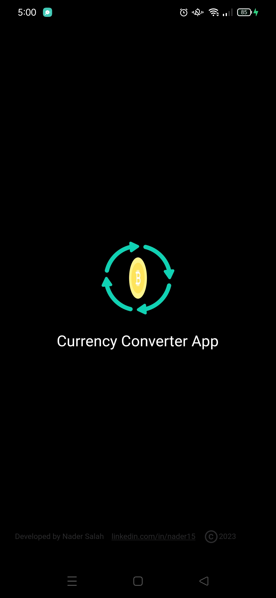
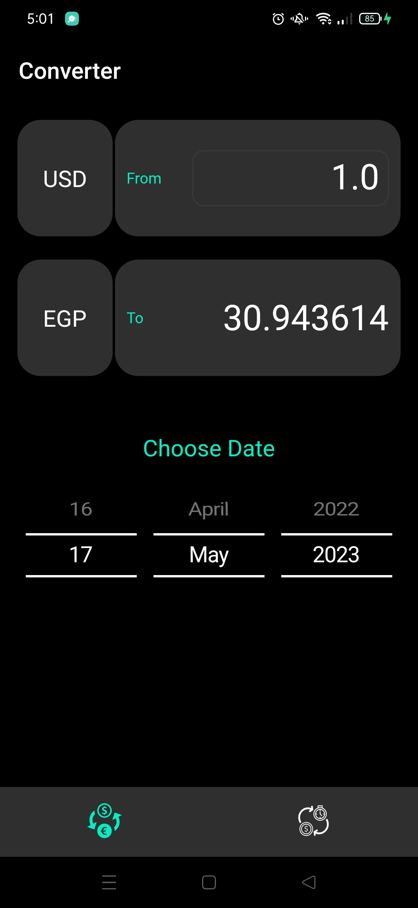
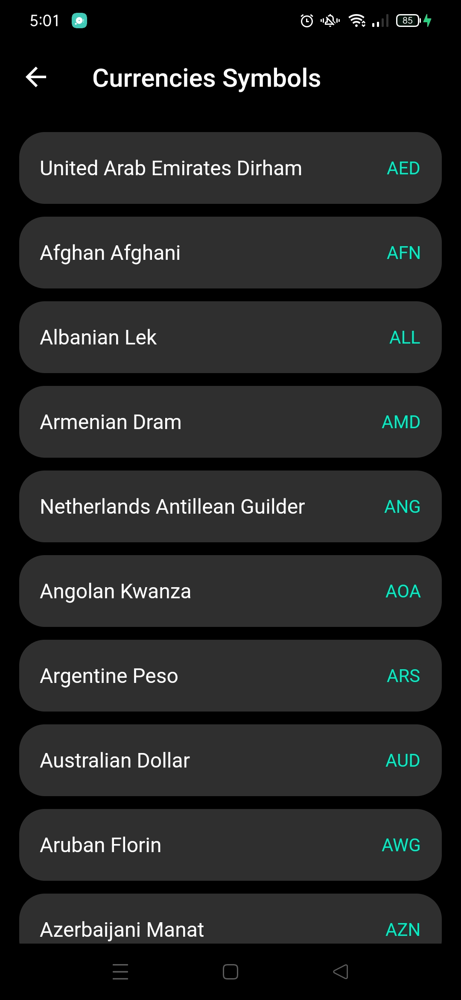
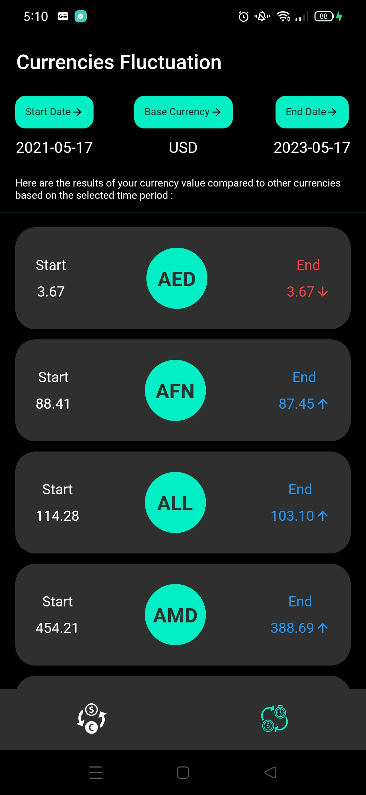
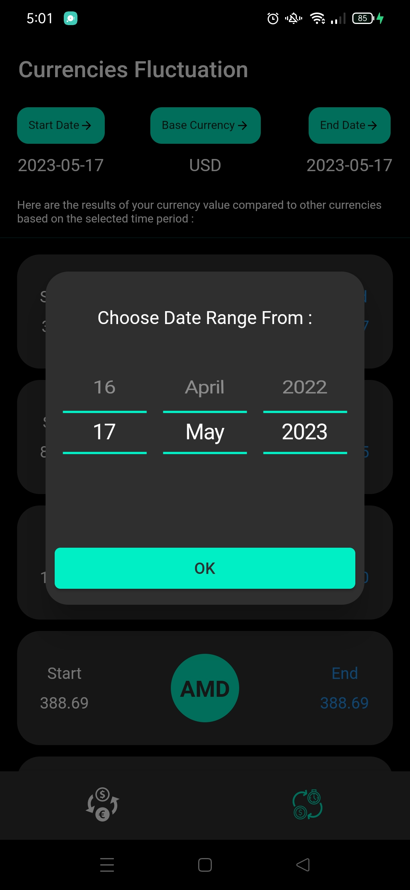
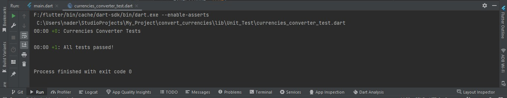
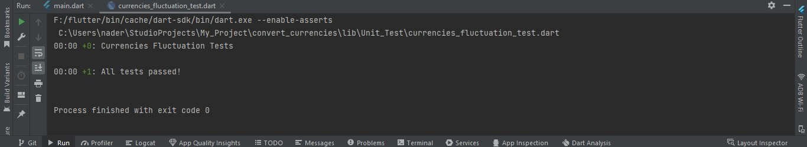
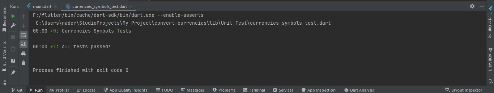

# Currency's Conversion

An application that can be run on Android and iOS implemented with Dart programming language anf Flutter framework .
The App has Two main Features : 

1. The App Can get the currency value through a specific date compared to another currency 
2. The App Can get Currency value compared to other currencies based on the selected time period

- the user can input the start date and end date for the desired period of time.
- also can input base currency and the currency they would like to convert to.
- any Data called from an API be paginated and shows 10 records per API call

## ScreenShots App Screens

<table>
    <tr>`
        <td></td>
        <td></td>
        <td></td>
    </tr>
    <tr>
        <td></td>
        <td></td>
        <td></td>
    </tr>
</table>

## Unit Testing

unit tests for the AppServices class that handle: 

- Receive two currencies conversion result from api.
- Receive Currency value compared to other currencies based on the selected time period.
- Receive two currencies symbols that needed to do Two Currencies Conversion and Currency value compared to other currencies based on the selected time period.

## ScreenShot of Unit Testing Result

<table>
    <tr>
        <td></td>
    </tr>
</table>
<table>
    <tr>
        <td></td>
    </tr>
</table>
<table>
    <tr>
        <td></td>
    </tr>
</table>

## Android Application

Install Application From Google drive [Install](https://drive.google.com/file/d/1luArLyXmLXE0PDHXcvm16rFWJOcpYdhj/view?usp=sharing)

